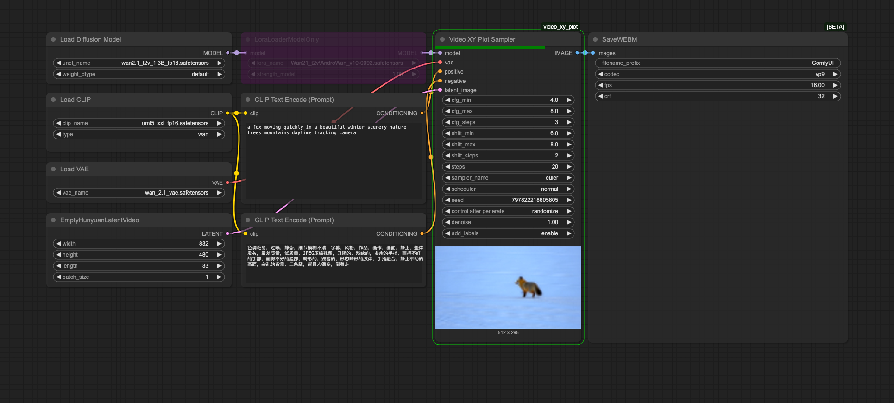

# Video XY Plot for ComfyUI

A very basic custom node for ComfyUI that creates XY plots comparing different CFG and Shift values for Wan Video models.

## Demo

Below is a demonstration of the Video XY Plot Sampler node in action:



### Demo Video Plot
<video src="assets/VideoXYBasicDemo.mp4" controls></video>

### Demo Workflow
You can download and import the [demo workflow JSON file](assets/VideoXYBasicWorkflow.json) directly into ComfyUI by dragging and dropping it into the interface.

## Quickstart

1. Install [ComfyUI](https://docs.comfy.org/get_started).
2. Install [ComfyUI-Manager](https://github.com/ltdrdata/ComfyUI-Manager)
3. ~~Look up this extension in ComfyUI-Manager.~~ If you are installing manually, clone this repository under `ComfyUI/custom_nodes`.
4. Restart ComfyUI.

# Features

This is a very basic node. It does not have many options.
- **Parameter Comparison**: Create grids comparing different CFG and Shift values
- **Customizable Ranges**: Set min, max, and step count for both CFG and Shift values
- **Automatic Labeling**: Clear labels for each parameter combination

## Usage

1. Connect a model to the "model" input
2. Connect a VAE to the "vae" input
3. Connect positive and negative conditioning to the respective inputs
4. Connect an empty video latent image (can be a video latent with multiple frames)
5. Adjust the CFG and Shift ranges as needed
6. Run the node to generate the XY plot

This node essentially combines the SodelSamplingSD3, Ksampler, and VAE Decode nodes. It does not do much more than that. The output is a decoded grid of videos. Individual videos are not output.

## Develop

To install the dev dependencies and pre-commit (will run the ruff hook), do:

```bash
cd video_xy_plot
pip install -e .[dev]
pre-commit install
```

The `-e` flag above will result in a "live" install, in the sense that any changes you make to your node extension will automatically be picked up the next time you run ComfyUI.

## Tests

This repo contains unit tests written in Pytest in the `tests/` directory. It is recommended to unit test your custom node.

- [build-pipeline.yml](.github/workflows/build-pipeline.yml) will run pytest and linter on any open PRs
- [validate.yml](.github/workflows/validate.yml) will run [node-diff](https://github.com/Comfy-Org/node-diff) to check for breaking changes

## Publishing to Registry

If you wish to share this custom node with others in the community, you can publish it to the registry. We've already auto-populated some fields in `pyproject.toml` under `tool.comfy`, but please double-check that they are correct.

You need to make an account on https://registry.comfy.org and create an API key token.

- [ ] Go to the [registry](https://registry.comfy.org). Login and create a publisher id (everything after the `@` sign on your registry profile). 
- [ ] Add the publisher id into the pyproject.toml file.
- [ ] Create an api key on the Registry for publishing from Github. [Instructions](https://docs.comfy.org/registry/publishing#create-an-api-key-for-publishing).
- [ ] Add it to your Github Repository Secrets as `REGISTRY_ACCESS_TOKEN`.

A Github action will run on every git push. You can also run the Github action manually. Full instructions [here](https://docs.comfy.org/registry/publishing). Join our [discord](https://discord.com/invite/comfyorg) if you have any questions!
